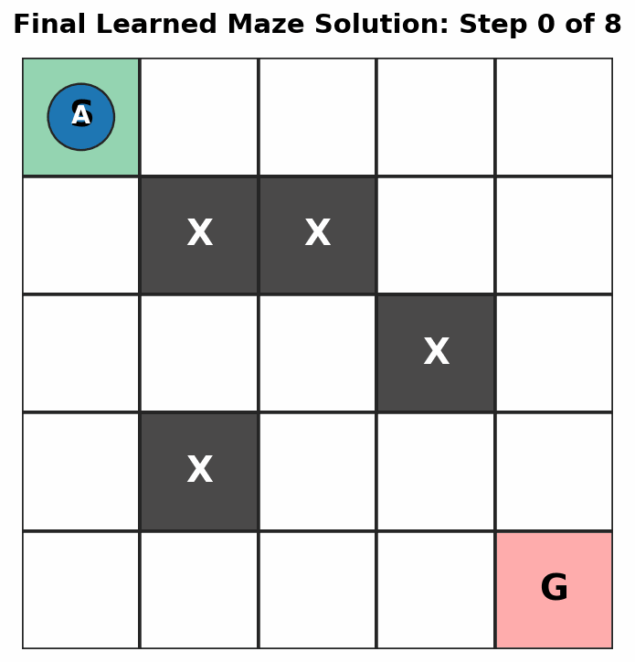
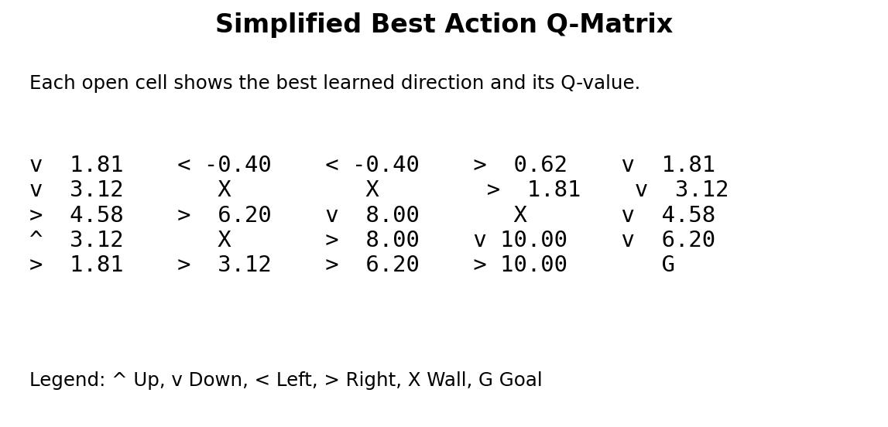

# Maze Runner Reinforcement Learning Project

This is a beginner-friendly reinforcement learning project in Python.

The agent learns how to escape a small maze using **Q-learning**.

## What the final solution looks like

The agent starts at `S`, avoids the walls marked as `X` and reaches the goal `G`.



The animation shows the agent moving from `S` to `G`. The blue line shows the learned path after training.

## Simplified learned Q-matrix

The actual Q-table stores four values per cell:

```text
[Up, Down, Left, Right]
```

To make it easier to read, this project also prints a simplified matrix showing only the best action and the best Q-value for each cell.



## Project structure

```text
maze_rl_project/
├── maze_env.py
├── agent.py
├── train.py
├── README.md
└── assets/
    ├── final_solution.gif
    ├── final_solution.png
    └── best_q_matrix.png
```

## File overview

### `maze_env.py`

This file contains the environment.

The environment controls:

```text
maze layout
start position
goal position
walls
rewards
movement rules
terminal display
```

It does **not** contain Q-learning logic.

### `agent.py`

This file contains the Q-learning agent.

The agent controls:

```text
Q-table
action selection
exploration vs exploitation
Q-value updates
Q-table display
```

### `train.py`

This file connects the environment and the agent.

It:

```text
runs training episodes
shows step-by-step training animation
prints Q-value updates
shows the final learned path
prints the final full Q-table
```

## How to run

Install NumPy:

```bash
pip install numpy
```

Then run:

```bash
python train.py
```

## Maze

The maze is:

```text
S . . . .
. X X . .
. . . X .
. X . . .
. . . . G
```

Legend:

```text
S = start
G = goal
X = wall
A = agent
* = visited path
```

## How the Q-table works

The Q-table has this shape:

```text
rows x columns x actions
```

For this maze:

```text
5 x 5 x 4
```

Each open cell stores four values:

```text
[Up, Down, Left, Right]
```

For example:

```text
Cell (4,3) = [8.50, -0.10, 5.00, 10.00]
```

This means:

```text
Up    =  8.50
Down  = -0.10
Left  =  5.00
Right = 10.00
```

The best action from that cell is `Right`, because `10.00` is the largest value.

## Core learning loop

The training loop follows this pattern:

```python
state = env.reset()

while not done:
    action = agent.choose_action(state)
    next_state, reward, done = env.step(action)
    agent.update(state, action, reward, next_state)
    state = next_state
```

That is the basic reinforcement learning cycle:

```text
state -> action -> reward -> next state -> update knowledge
```

## What to try next

Good next experiments:

```text
change the maze layout
change the reward values
increase or decrease epsilon
try a larger maze
compare Q-learning with SARSA
```
