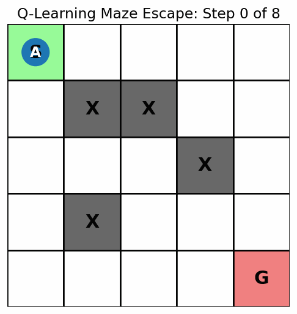

# Q-Learning Maze Escape

This is a beginner-friendly reinforcement learning project in Python. The goal is to train an agent to escape a small maze using **Q-learning**, one of the simplest and most useful reinforcement learning algorithms.

The agent starts at `S`, explores the maze, learns from rewards and penalties, then eventually finds a good path to the goal `G`.



## What this project teaches

This project introduces the basic ideas behind reinforcement learning:

- **Agent**: the learner moving through the maze
- **Environment**: the maze grid
- **State**: the agent's current location in the maze
- **Action**: moving up, down, left or right
- **Reward**: feedback after each move
- **Policy**: the learned strategy for choosing actions
- **Q-table**: a table that stores how useful each action is from each state
- **Exploration vs exploitation**: trying random moves versus using what has already been learned

## Maze setup

The maze is a 5 by 5 grid:

```text
S . . . .
. X X . .
. . . X .
. X . . .
. . . . G
```

Where:

```text
S = Start
G = Goal
X = Wall
. = Open space
A = Agent
* = Visited path
```

## Reward system

The agent receives rewards or penalties based on what happens after each move:

| Result | Reward |
|---|---:|
| Move to open space | -1 |
| Hit a wall or boundary | -5 |
| Reach the goal | +10 |

The small negative reward for each move encourages the agent to find a shorter path.

## How Q-learning works in this code

The code uses a Q-table with one value for every possible action from every cell in the maze.

For each step, the agent chooses an action using an epsilon-greedy strategy:

- Sometimes it explores by picking a random action.
- Most of the time it exploits what it has already learned by choosing the action with the highest Q-value.

After each move, the Q-table is updated using:

```text
Q(s, a) = Q(s, a) + alpha * (reward + gamma * max(Q(next_state)) - Q(s, a))
```

In simple words, the agent updates its memory based on:

- what it expected to happen
- what actually happened
- how good the next state looks

## Main parameters

```python
alpha = 0.1       # learning rate
gamma = 0.9       # importance of future rewards
epsilon = 0.2     # chance of taking a random action
episodes = 5000   # number of training rounds
```

### What these mean

- `alpha` controls how quickly the agent updates what it knows.
- `gamma` controls how much the agent cares about future rewards.
- `epsilon` controls how often the agent explores random moves.
- `episodes` controls how many times the agent trains from start to goal.

## Terminal animation

During training, the code shows selected episodes step by step. This helps you see the agent move through the maze while it is still learning.

At the end, the code shows the final learned path from `S` to `G`.

Example final path:

```text
S . . . .
* X X . .
* * * X .
. X * * *
. . . . G
```

## How to run

Install NumPy:

```bash
pip install numpy
```

Run the script:

```bash
python maze_rl.py
```

## Suggested file structure

```text
q-learning-maze-escape/
├── maze_rl.py
├── README.md
└── maze_escape_final_path.gif
```

## Ideas to improve it

Once the basic version works, try these upgrades:

- Make the maze bigger.
- Add more walls.
- Add traps with large negative rewards.
- Randomize the start and goal positions.
- Save the Q-table after training.
- Plot total reward over time.
- Compare different values of `alpha`, `gamma` and `epsilon`.
- Use Pygame to make a nicer visual version.

## Why this is a good first reinforcement learning project

This project is small enough to understand line by line, but it still contains the most important parts of reinforcement learning. Before using advanced libraries or neural networks, this project helps you understand what the agent is actually learning.
