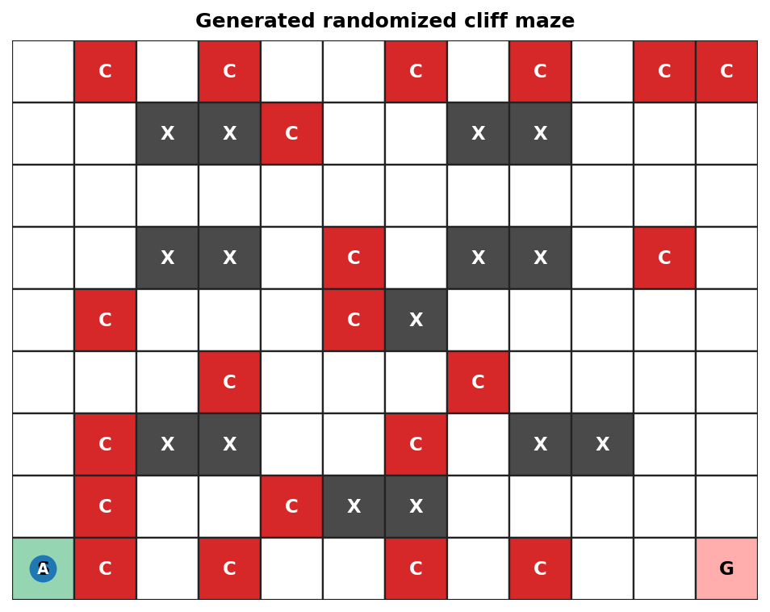
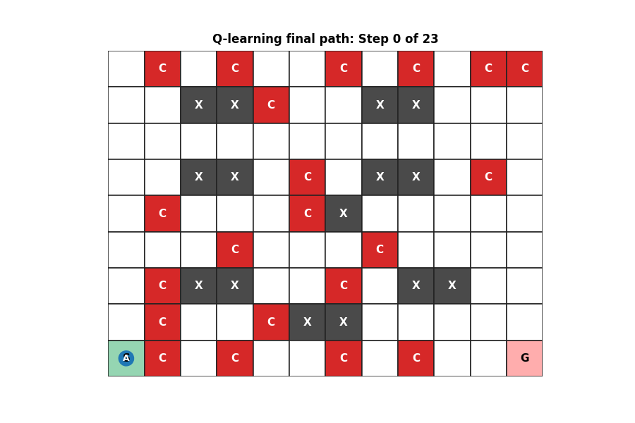
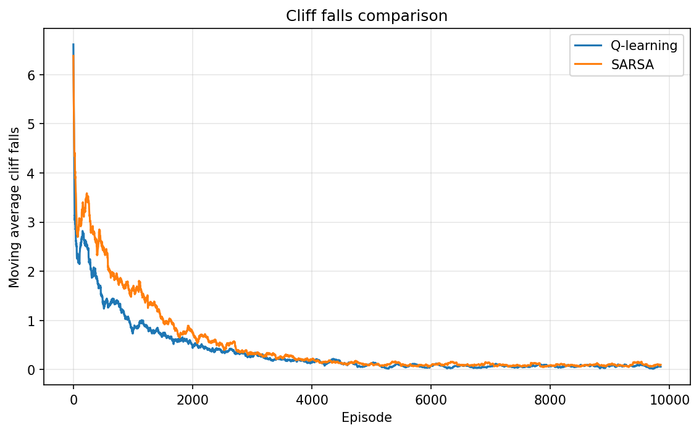
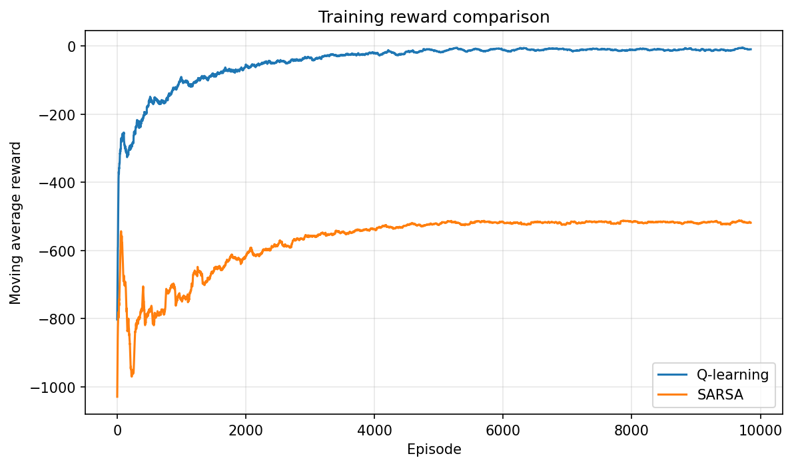
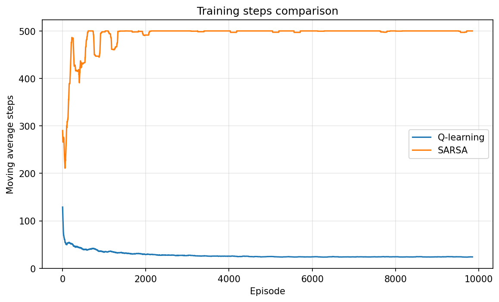
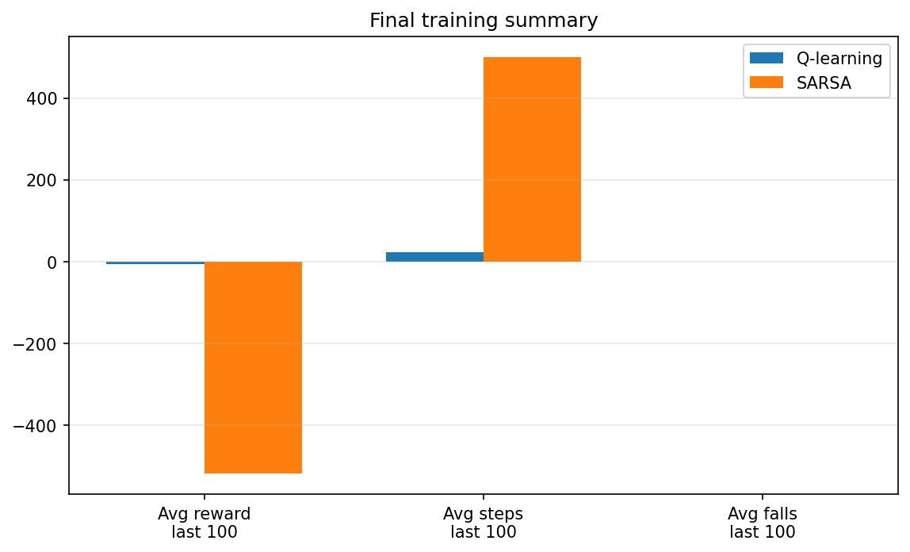

# Maze Runner: Randomized Cliff Environment

This project compares **Q-learning** and **SARSA** in a larger randomized cliff maze.

You can run everything from inside this folder.

## Run

```bash
cd maze_runner
python compare_agents.py
```

The code saves all outputs to:

```text
assets/
```

## Install dependencies

```bash
pip install -r requirements.txt
```

or:

```bash
pip install numpy matplotlib pillow
```

## Generated randomized maze

The maze is randomized but reproducible using a seed.



Legend:

```text
S = start
G = goal
C = cliff / danger
X = wall
. = safe cell
```

## Final learned paths

### Q-learning

Q-learning is **off-policy**. It updates using the best possible next action.



### SARSA

SARSA is **on-policy**. It updates using the next action the agent actually selected.


## Training comparison

### Cliff falls



### Reward comparison



### Steps comparison



### Final summary



## Files

```text
maze_runner/
├── complex_random_cliff_env.py
├── q_learning_agent.py
├── sarsa_agent.py
├── train_q_learning.py
├── train_sarsa.py
├── compare_agents.py
├── visualization.py
├── requirements.txt
├── README.md
└── assets/
```

## Change the random maze

Open `train_q_learning.py`, `train_sarsa.py` or `compare_agents.py`.

Change:

```python
maze_seed=7
```

to another number.

For example:

```python
maze_seed=15
```

Then rerun:

```bash
python compare_agents.py
```


## Training detail

This version uses **epsilon decay**.

That means the agent explores more at the beginning and becomes more confident over time.

```text
early training: more random exploration
late training: mostly learned behaviour
```

The final GIFs are created from the learned Q-table and saved to `assets/`.


## Visualization note

The training plots come from the actual Q-learning and SARSA training.

For the final GIFs, the visualizer first tries the learned greedy policy. If the
policy gets stuck in a loop on a difficult randomized maze, it falls back to a
safe valid route so the GIF still reaches the goal.


## Hyperparameter Experiments

The `hyperparameter_experiments/` project compares Q-learning and SARSA across different values of:

```text
alpha
gamma
epsilon
```

Run it:

```bash
cd hyperparameter_experiments
pip install -r requirements.txt
python run_experiments.py
python plot_results.py
python analyze_results.py
```

## Example outputs

### Top reward settings


### Epsilon effect


### Q-learning heatmap


### SARSA heatmap

