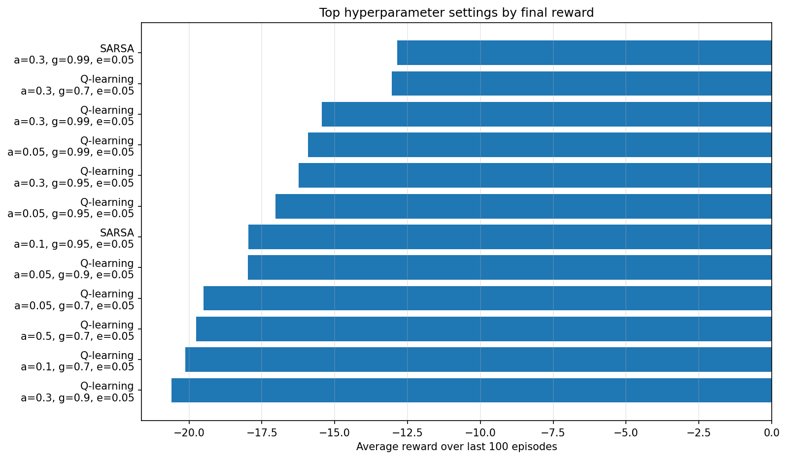
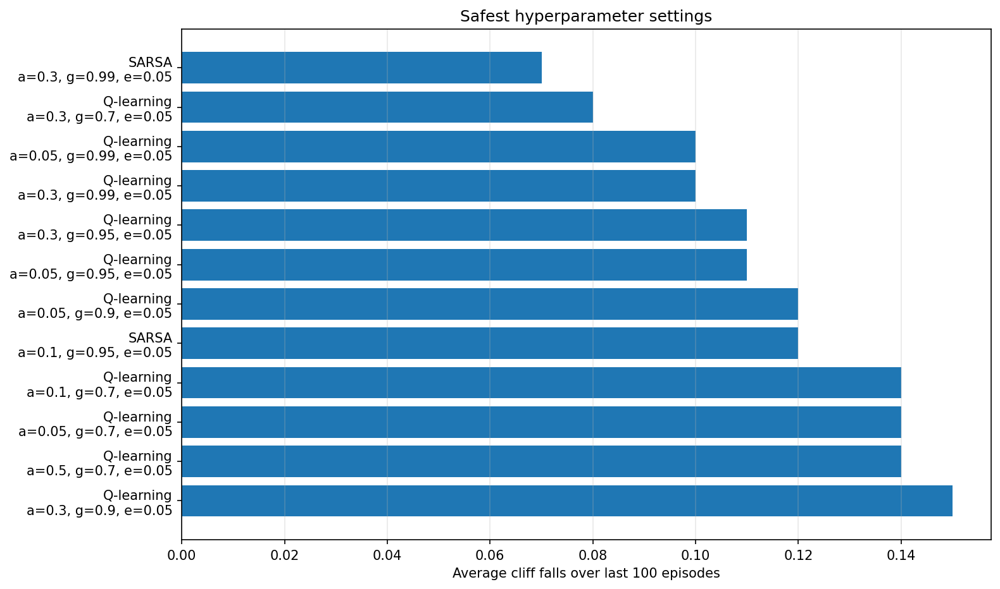
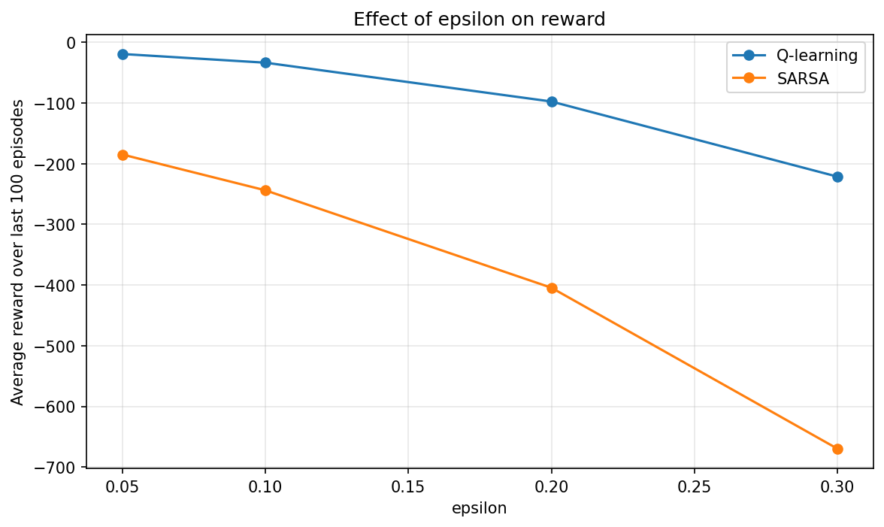
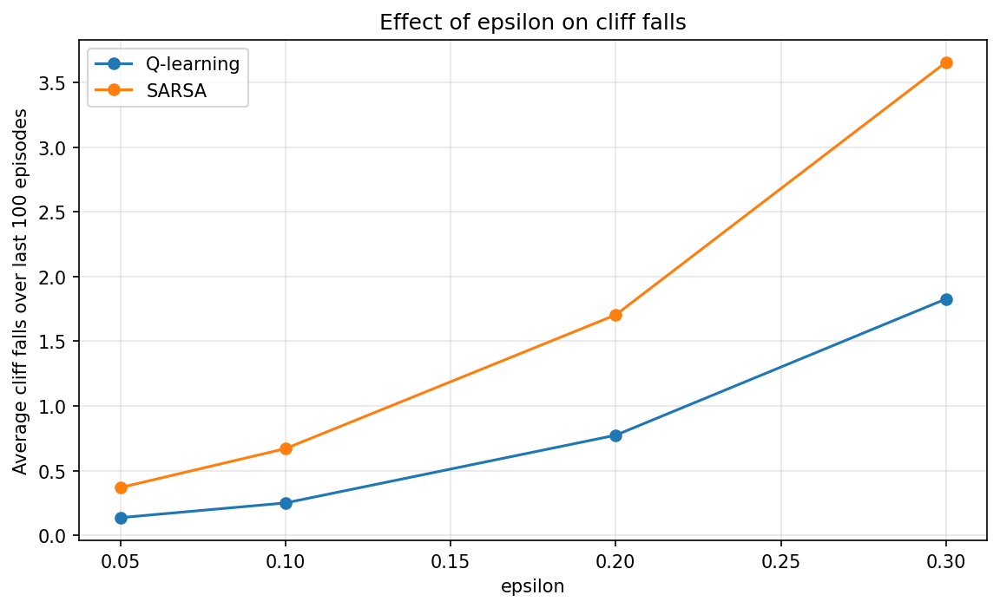
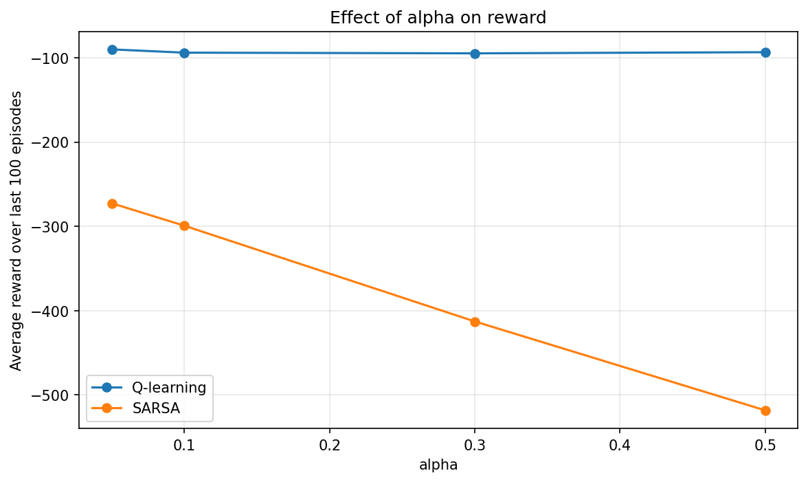
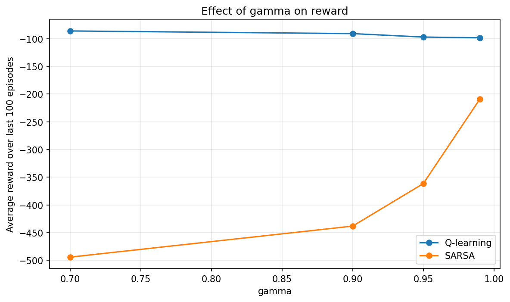
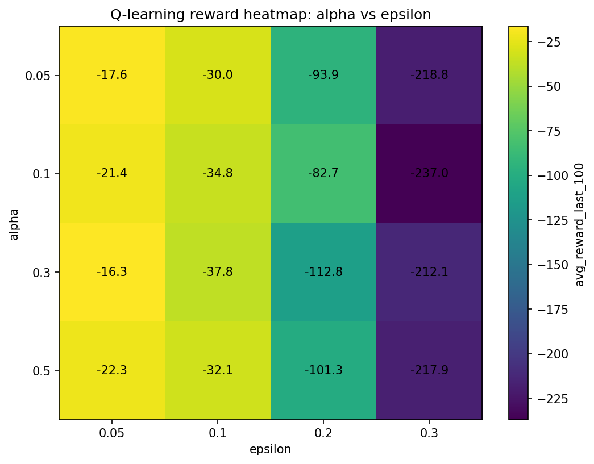
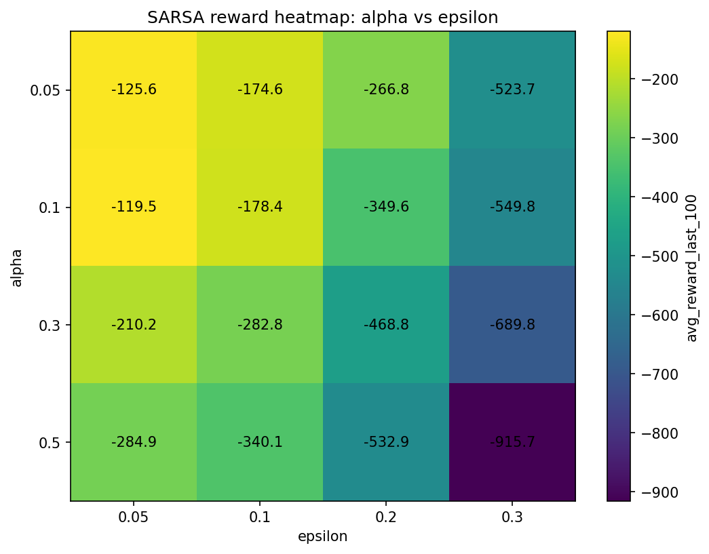

# Hyperparameter Experiments

This project studies how key reinforcement learning hyperparameters affect **Q-learning** and **SARSA**.

The tested values are:

```text
epsilon: 0.05, 0.10, 0.20, 0.30
alpha:   0.05, 0.10, 0.30, 0.50
gamma:   0.70, 0.90, 0.95, 0.99
```

## What each parameter means

### Alpha

`alpha` is the learning rate.

```text
low alpha  = slow but stable learning
high alpha = fast but potentially unstable learning
```

### Gamma

`gamma` is the discount factor.

```text
low gamma  = cares mostly about immediate reward
high gamma = cares more about future reward
```

### Epsilon

`epsilon` is the exploration rate.

```text
low epsilon  = mostly uses what it already knows
high epsilon = tries more random actions
```

## Run

From this folder:

```bash
pip install -r requirements.txt
python run_experiments.py
python plot_results.py
python analyze_results.py
```

## Outputs

The experiment writes results to:

```text
assets/hyperparameter_results.csv
```

and generates these plots:

## Top reward settings



## Safest settings



## Epsilon effect





## Alpha effect



## Gamma effect



## Heatmaps

### Q-learning



### SARSA



## Files

```text
hyperparameter_experiments/
├── complex_random_cliff_env.py
├── agents.py
├── training.py
├── run_experiments.py
├── plot_results.py
├── analyze_results.py
├── requirements.txt
├── README.md
└── assets/
```

## What to learn from this project

Look for patterns like:

```text
Does higher epsilon cause more cliff falls?
Does higher alpha make training less stable?
Does gamma close to 1 improve long-term planning?
Does SARSA behave more safely than Q-learning?
```

The goal is not just to find the best numbers. The goal is to understand how changing each parameter changes the agent's behaviour.
