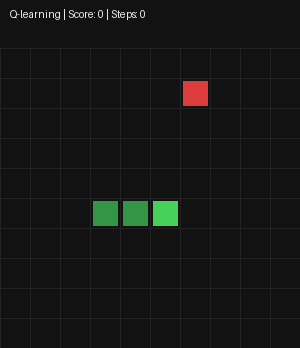
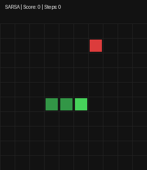
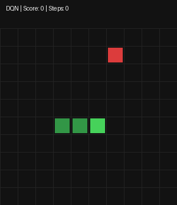
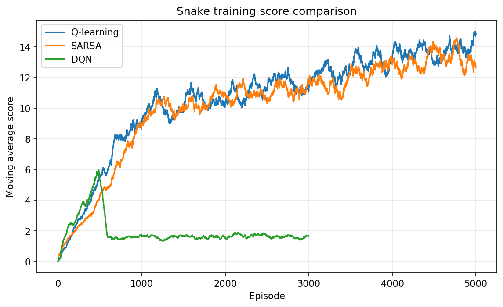
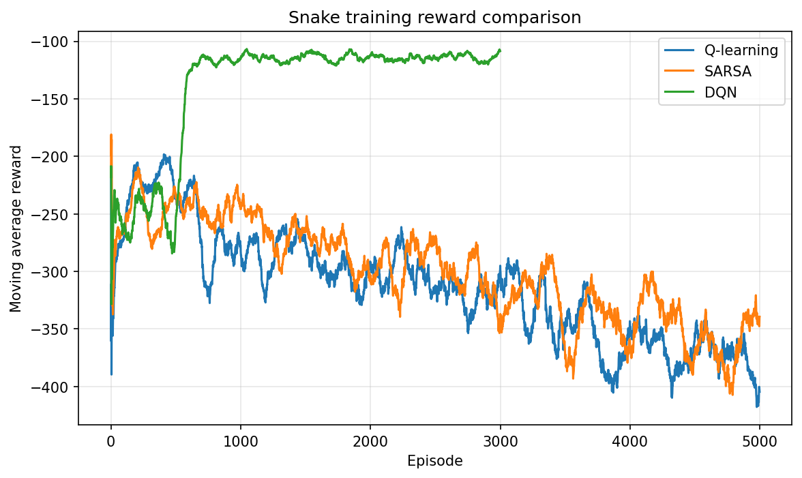
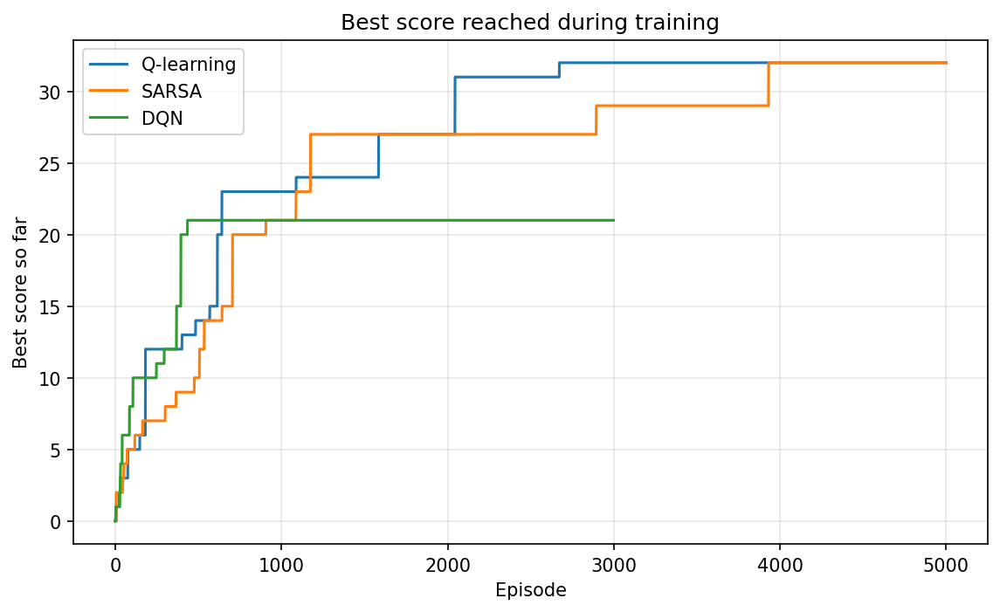
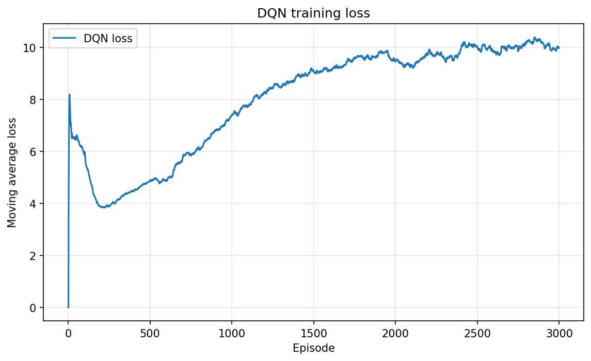
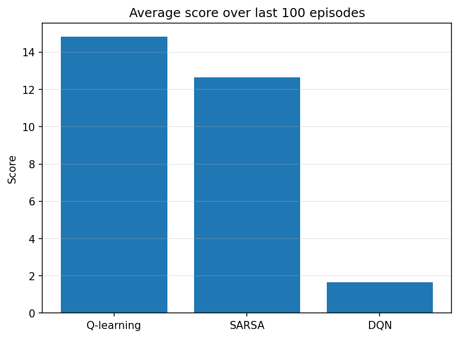

# Snake Game with Improved Reinforcement Learning

This folder contains the full Snake project in one place.

It includes:

```text
1. playable Snake game
2. frame-to-GIF and frame-to-video scripts
3. Q-learning Snake agent
4. SARSA Snake agent
5. DQN Snake agent
6. comparison plots
7. gameplay GIFs and MP4 videos
```

The main change in this version is that the agents get better reward shaping and better state features.

Earlier versions often learned bad behaviours:

```text
Q-learning: run into a wall
DQN: rotate around itself
```

This version adds:

```text
stronger death penalty
stronger food reward
loop/spin penalty
action-based open-space features
action-based tail-reach features
best-agent video generation
```

---

## Install dependencies

From inside this folder:

```bash
pip install -r requirements.txt
```

---

# 1. Play Snake manually

```bash
python snake_game.py
```

Controls:

```text
Arrow keys = move
R          = restart after game over
```

---

# 2. Generate simple Snake frames and video

Generate frames:

```bash
python generate_snake_frames.py
```

Create MP4:

```bash
python frames_to_video.py
```

Create GIF:

```bash
python frames_to_gif.py
```

Outputs:

```text
assets/snake_demo.mp4
assets/snake_demo.gif
```

---

# 3. Train Q-learning, SARSA and DQN

Run the full comparison:

```bash
python compare_agents.py
```

This will:

```text
1. train Q-learning
2. train SARSA
3. train DQN
4. save training CSV files
5. save the best agent for each method
6. create comparison plots
7. create gameplay GIFs and MP4 videos from the best saved agents
```

## Faster test run

For a quick test:

```bash
python compare_agents.py --q-episodes 500 --sarsa-episodes 500 --dqn-episodes 500
```

## Better training run

For more meaningful results:

```bash
python compare_agents.py --q-episodes 5000 --sarsa-episodes 5000 --dqn-episodes 5000
```

DQN usually needs more episodes than Q-learning and SARSA.

---

# Gameplay videos

After running `compare_agents.py`, these files are regenerated.

## Q-learning



MP4:

```text
assets/q_learning_game.mp4
```

## SARSA



MP4:

```text
assets/sarsa_game.mp4
```

## DQN



MP4:

```text
assets/dqn_game.mp4
```

---

# Training comparison plots

## Score comparison



## Reward comparison



## Best score comparison



## DQN loss



## Final summary



---

# How the RL Snake works

The agents do not see the full screen as pixels.

Instead, they see a compact state made of features.

## Old simple state

The first simple version only had features like:

```text
danger straight
danger right
danger left
food direction
current movement direction
```

That was not enough. The agent could learn immediate wall avoidance, but it could not tell whether a move would trap it later.

## Improved state

This version adds action-based features:

```text
danger straight
danger right
danger left

moving up
moving down
moving left
moving right

food up
food down
food left
food right

food is closer if straight
food is closer if turn right
food is closer if turn left

open space if straight
open space if turn right
open space if turn left

can reach tail if straight
can reach tail if turn right
can reach tail if turn left
```

This gives the agent a small amount of planning-like information.

It can learn:

```text
straight moves closer to food but traps me
turning right gives more open space
turning left keeps the tail reachable
```

---

# Actions

The agents use relative actions:

```text
0 = go straight
1 = turn right
2 = turn left
```

Relative actions are easier than absolute actions because the meaning depends on the snake's current direction.

---

# Reward system

This version uses stronger and more directed rewards.

```text
+50     eating food
-100    dying
-0.10   normal move
+1.0    moving closer to food
-1.0    moving farther from food
-0.05   turning
-0.5    repeated turning/spinning
-10     too little reachable space
-5      head cannot reach tail
+0.5    head can reach tail
-30     too long without food
```

The goal is to teach:

```text
do not die
do not spin forever
move toward food
eat food
avoid traps
keep open space
keep access to the tail
```

---

# Q-learning

Q-learning uses a table:

```text
Q[state, action]
```

It is off-policy.

It updates using the best possible future action:

```python
future_best_q = max(Q[next_state])
```

Plain meaning:

```text
What is the best thing I could do next?
```

---

# SARSA

SARSA also uses a table:

```text
Q[state, action]
```

It is on-policy.

It updates using the next action the agent actually selected:

```python
future_q = Q[next_state, next_action]
```

Plain meaning:

```text
What actually happened when I followed my current behaviour?
```

---

# DQN

DQN replaces the Q-table with a neural network.

Instead of storing every value in a table:

```text
Q[state, action]
```

DQN learns a function:

```text
state -> neural network -> Q-values for actions
```

DQN uses:

```text
experience replay
target network
epsilon decay
```

This is the first step toward deep reinforcement learning.

---

# Project files

```text
snake_game/
├── snake_game.py
├── generate_snake_frames.py
├── frames_to_video.py
├── frames_to_gif.py
├── snake_env.py
├── agents.py
├── dqn_agent.py
├── train_q_learning.py
├── train_sarsa.py
├── train_dqn.py
├── evaluate_and_video.py
├── compare_agents.py
├── rendering.py
├── requirements.txt
├── README.md
├── frames/
└── assets/
```

---

# Notes

This is still not a perfect Snake AI.

The agents should behave better than before, but tabular methods are still limited because the state is compressed.

For a stronger next step, use a DQN that sees either:

```text
the full grid
or image-like board representation
```

That would allow the agent to learn more complete board strategy.
